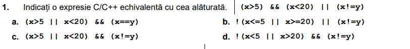
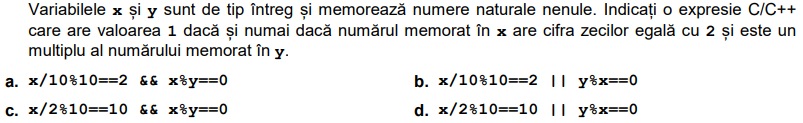
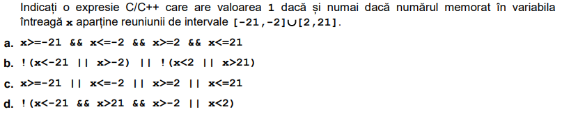
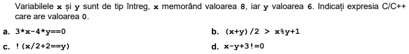

# Elemente de baza ale limbajului C++

## 1. Citirea valorilor variabilelor de la tastatura
- Citire variabile de la tastatura:
    1. Variabila cu variabila:
        ```c++
            int a, b, c;
            cin >> a;
            cin >> b;
            cin >> c;
        ```
    2. Citirea tuturor variabilelor intr-un singur apel:
        ```c++
            int a, b, c;
            cin >> a >> b >> c
        ```
        - De retinut: valorile se citesc in ordinea in care sunt specificate
- Afisarea valorilor:
    - Indiferent daca vorbim de o expresie sau de o variabila, afisarea va functiona in acelasi fel.
    - Afisare variabile:
        ```c++
            int a, b, c;
            // ... presupunem ca variabilele au deja valori
            cout << a << b << c;
        ```
        - De asemenea, la fel precum function `cin`, valorile vor fi afisate in ordinea in care sunt specificate in lista.
    - Afisare expresii:
        ```c++
            cout <<  4 * 5 + 34
        ```
        - De retinut:
            - Se pastreaza precedenta operatorilor exact precum in exercitiile de matematica
            - Daca dorim sa impunem o anumita ordine de efectuare a operatiilor, trebuie sa folosim paranteze. De exemplu, pentru a efectua o adunare inainte de o inmultire:
                ```c++
                    cout << (2 + 5) * 4;
                ```
## 2. Instructiuni conditionale
- Determina cursul de executie al programului prin evaluarea anumitor conditii.
- In C++ sunt 2 tipuri de instructiuni conditionale:
    1. `if` / `if-else`
    2. `switch`

- Structura `if`:
    ```c++
        if (expresie)
            ruleaza-set-instructiuni
        else if (alta expresie)
            ruleaza-alt-set-instructiuni
        // aici putem avea oricat de multe conditii.
        else
            ruleaza-set-instructiuni-default
            // Aceste instructiuni se ruleaza in cazul niciuna dintre conditiile de mai sus nu au fost evaluate ca fiind adevarate
    ```
    - De retinut:
        - dintr-o expresie folosita intr-o instructiune `if` trebuie sa rezulte fie valoarea `true` fie valoarea `false`
        - Valoarea `0` este considerata `false`, orice alta valoarea este considerata `true`.
            - !!! Valorile negative sunt considerate de asemenea `true`:
                ```c++
                    if (-1) {
                       cout << "Acest mesaj va fi afisat";
                    }
                    else {
                       cout << "Acest mesaj NU va fi afisat.";
                    }
                ```
        - Desi nu este obligatoriu, chiar daca avem o singura instructiune pentru oricare dintre ramuri (`if`, `else if`, `else`), este indicat sa folosim acoladele!
        - Ramura de `else` sau `else if` trebuie sa fie precedata de o ramura `if` si intotdeauna sa fie ultima ramura.


- Structura `switch`
    - Atunci cand ne trezim in situatia de a avea o succesiune de mai multe if/else if instructiuni, unde verificam faptul ca expresia poate avea o valoare anume dintr-un set bine stabilit de valori, este recomandat sa folosim structura `switch`
    - Exemplu: Avem un program care verifica daca valoarea unei variabile este una dintre cele 5 vocale, atunci executam o oarecare instructiune:
        ```c++
            char ch;
            cout << "Enter a character: ";
            cin >> ch;
            if (ch == 'a') {
                cout << "Ati introdus valoarea a";
            }
            else if (ch == 'e') {
                cout << "Ati introdus valoarea e";
            }
            else if (ch == 'i') {
                cout << "Ati introdus valoarea i";
            }
            else if (ch == 'o') {
                cout << "Ati introdus valoarea o";
            }
            else if (ch == 'u') {
                cout << "Ati introdus valoarea u";
            }
            else {
                cout << "Ati introdus un caracter care nu face parte din [a,e,i,o,u]";
            }
         ```
        - Aceasta poate fi rescrisa, folosind structura `switch` precum in bucata de cod de mai jos:
            ```c++
                char ch;
                cout << "Introduceti un caracter: ";
                cin >> ch;
                switch (ch) {
                case 'a':
                    cout << "Ati introdus valoarea a";
                    break;
                case 'e':
                    cout << "Ati introdus valoarea e";
                    break;
                case 'i':
                    cout << "Ati introdus valoarea i";
                    break;
                case 'o':
                    cout << "Ati introdus valoarea o";
                    break;
                case 'u':
                    cout << "Ati introdus valoarea u";
                    break;
                default:
                    cout << "Ati introdus un caracter care nu face parte din [a,e,i,o,u]";
                }
            ```
    - Tinand cont de ce am observat in bucata de cod de mai sus, putem deduce urmatoarea sintaxa pentru structura `switch`:
        ```c++
            switch (expresie){
                case valoare_1:
                    executa_set_de_instructiuni_1;
                    break;
                case valoare_2:
                    executa_set_de_instructiuni_2;
                    break;
                ...
                case valoare_n:
                    executa_set_de_instructiuni_n;
                    break;
                default:
                    executa_set_instructiuni_default;
            }
        ```
        - DE RETINUT: Daca este omis keyword-ul `break`, executia se va muta la urmatorul `case` si va continua in acest ritm pana la intalnirea unui `case` ce va avea specificat keyword-ul `break` sau pana la executia tuturor `case`-urilor, in cazul in care niciuna nu va avea acest keyword.
        - Exemplu:
            ```c++
                char ch;
                cout << "Introduceti un caracter: ";
                cin >> ch;
                switch (ch) {
                    case 'a':
                        cout << "Ati introdus valoarea a" << endl;
                    case 'e':
                        cout << "Ati introdus valoarea e" << endl;
                    case 'i':
                        cout << "Ati introdus valoarea i" << endl;
                    case 'o':
                        cout << "Ati introdus valoarea o" << endl;
                        break;
                    case 'u':
                        cout << "Ati introdus valoarea u" << endl;
                        break;
                    default:
                        cout << "Ati introdus un caracter care nu face parte din [a,e,i,o,u]";
    }
            ```
                - In cazul in care, utilizatorul introduce de la tastatura, caracterul `i`, bucata de cod anterior va afisa: 
                    ```js
                        Ati introdus valoarea i
                        Ati introdus valoarea o
                    ```

## 3. Instructiuni repetitive
In C++ avem 3 tipuri de instructiuni repetitive:
    - Cu conditie initiala: `while`
    - Cu conditie finala:  `do while`
    - Cu numar cunoscut de pasi: `for`
### 3.1 Cu conditie initiala: `while`:
- Sintaxa structurii `while` este urmatoarea:
    ```c++
        while (expresie) {
            //executa bloc de instructiuni
        }
    ```
- La fel ca in cazul structurii `if`, expresia folosita in cadrul `while`, este considerata adevarata (true) daca are o valoare diferita de `0`.
    - Putem folosi atat operatii logice (e.g `a > b`, `a != b`, `a == b`) cat si expresii matematica (`a * b`, `n`, etc) deoarece in final se va testa valoarea rezultatului expresiei
- Orice variabila declarata in interiorul corpului structurii `while`, va fi vizibila (accesibila) doar in cadrul structurii `while`
    - DE RETINUT: La fiecare noua iteratie, orice variabila declarata in cadrul structurii `while` va fi reinitializata!

### 3.2 Cu Conditie finala
- Instructiunea repetitiva cu conditie finala, este instructiunea `do while`
- Sintaxa acestei structuri, este urmatoarea:
    ```c++
        do {
            //executa set de instructiuni
        } while (expresie)
    ```
- Diferenta dintre structura `while` si structura `do-while` este faptul ca expresia folosita ca si conditie de continuare a iteratiilor din cazul structurii `while`, se transforma in conditie de oprire, in cazul structurii `do-while`

### 3.3 Cu numar finit de pasi
- Instructiunea repetitiva cu numar finit de pasi, este instructiunea `for`
- Sintaxa instructiunii `for` este urmatoarea:
    ```c++
        for (<initializare contor>;<conditie_oprire>;<incrementare_contor>) {
            //executa set de instructiuni
        }
    ```
- De retinut:
    - Pasul de initializare contor se executa o singura data, anume la inceputul primei iteratii
    - Pasul de verificare a conditiei de oprire se executa de fiecare data, inainte de a executa instructiunile ce se gasesc in interiorul structurii `for`
        - In cazul in care conditia nu este indeplinita (are valoarea 0, sau false), iteratiile sunt oprite si programul continua executia instructiunilor care sunt in afara structurii (daca mai sunt altele, desigur)
    - Pasul de incrementare a contorului se executa doar dupa ce s-au executat instructiunile din interiorul structurii `for`,

### Caracteristici structuri iterative
- Orice variabila declarata in interiorul structurilor repetitive este vizibila doar in cadrul acelor structuri
- In cazul structurii `for`, contorul poate fi initializat atat in pasul de initializare cat si in afara, caz in care instructiunea ar arata in felul urmator, presupunand ca am numit contorul `i`:
    ```c++
        int i = 0;
        for (i; i < 10; i++) {
            cout << i << endl;
        }
    ```
- Pentru a opri atat iteratia curenta cat si urmatoarele iteratii, se foloseste keyword-ul `break`.
- Pentru a opri doar iteratia curenta, se foloseste keyword-ul `continue`.


## Operatorii de incrementare
- In C++, exista anumiti operatori, numiti operatori de incrementare care tot ce fac este sa mai incrementeze cu `1` o valoare existenta:
    - de exemplu:
        ```c++
            int age = 10;
            age++; // acest lucru este echivalent cu age = age + 1
            age--; // acest lucru este echivalent cu age = age - 1
        ```
    - De retinut ca acesti operatori pot fi folositi atat in forma sufixa: `i++, i--` cat si in forma prefixa: `++i, --i`
        - Daca se foloseste, de exemplu in header-ul unei structuri `for`, nu este  nici o diferenta.
        - Daca sunt folositi in expresii, diferenta intre cele doua este ca forma sufixa va incrementa valoarea DUPA ce variabila va fi folosita, iar in cazul formei prefixe, mai intai va fi incrementata valoarea, si dupa aceea variabila va fi folosita cu noua valoare.
    - Exemplu:
        ```c++
            int i = 10;
            cout << i++ ; // va afisa 10
            cout << i; // va afisa 11

            int v = 12;
            cout << ++i; // va afisa 13
            cout << i; // va afisa 13
        ```

## Operatorii relaționali
Printre operatorii relationali, avem:
- `<`- Mai mic
- `>`- Mai mare
- `<=`- Mai mic sau egal
- `>=`- Mai mare sau egal
- `==`- Egal
- `!=`- Diferit

Un operatori relațional stabilește dacă între două numere (operanzii) are loc o anumită relație. Rezultatul acestei operații este adevărat sau fals.
In urma evaluarii unei operatii cu un operator logic, rezultatul poate avea ca si valoare:
- 1 dacă relația este adevărată
- 0 dacă relația este falsă

- Exemplu: Consideram ca avem `N = 11` si `M = 3`. Astfel avem:
    - mai mic <; `N < M` este fals, adică 0
    - mai mare >; `N > M` este adevărat, adică 1
    - mai mic sau egal <=; `M <= N` este 1
    - mai mare sau egal >=; `M >= N` este 0
    - operația de egalitate == ; `N == M` este fals, adică 0
    - operația de neegalitate (diferit, not egal) !=; `N != M` este adevărat, adică 1.
### IMPORTANT
    - Este foarte usor sa gresim si sa folosim `=` in loc de `==` cand vrem sa comparam. Operatie care e valida din punct de vedere al sintaxei dar care va duce, in cele mai multe cazuri, la o logica eronata.

## Operatorii logici
Printre acestia avem:
- `!` - Negatie
- `||` - SAU
- `&&` - SI


- În C++, operatorii logici pot fi aplicați oricăror valori numerice, și au ca rezultat una din valorile 0 sau 1. În exemplele de mai jos vom folosi literalii true și false, de tip bool.

### `Negația: !`

- `! true` este `false`. Orice valoare nenulă negată devine 0.
``! false` este `true`. `40 negat devine 1.

### `Disjuncția: ||`

`false` || `false` → `false`
`false` || `true` → `true`
`true` || `false` → `true`
`true` || `true` → `true`

### `Conjuncția: &&`

`false` && `false` → `false`
`false` && `true` → `false`
`true` && `false` → `false`
`true` && `true` → `true`

### DE RETINUT!
- Operatorii logici SAU / SI, sunt operatori care scurtcircuiteaza operatiile:
    - Sa consideram ca avem urmatoarele expresii:
        - `10 > 3 || 4 > 1`
            - In acest caz, a doua comparatie nu va mai avea loc, este suficient sa stim ca o expresie este adevarata
        - `10 > 11 && 2 > 3`
            - In acest caz, la fel, a doua comparatie nu va mai avea loc, este suficient sa stim ca o expresie este falsa. 

## Exercitii propuse
- Pentru o mai buna intelegere a codului de mai jos, este recomandat sa il evaluati fie prin simpla citire, fie pe o foaie. Comparati rezultatul obtinut cu valoarea returnata de catre un IDE (de exemplu Code::blocks)
- In cazul in care credeti ca instructiunile nu sunt valide din punct de vede C++, ganditi-va care ar putea fi problema si verificati cu un IDE. De asemenea este recomandat sa observati mesajul de eroare returnat de catre IDE, pentru a va dezvolta abilitatile de programare si a rezolva mai usor problemele similare din viitor.

1. Care va fi rezultatul rularii urmatoarei bucate de cod:
    ```c++
        	int varsta;
            cout << "Introduceti varsta dumneavoastra: ";
            cin >> varsta;
            if (varsta >= 18) {
                cout << "Sunteti eligibil pentru a incepe scoala de soferi.";
            }
            else {
                cout << "Va rugam sa mai asteptati...";
            }
    ```
2. Ce se va afisa in urma rularii urmatoarei bucate de cod:
    ```c++
        int varsta;
        cout << "Introduceti varsta dumneavoastra: ";
        cin >> varsta;
        if (varsta >= 18) {
            cout << "Sunteti eligibil pentru a incepe scoala de soferi.";
        }
        else {
            cout << "Va rugam sa mai asteptati...";
        }
        else if (varsta > 9 && varsta < 18) {
            cout << "Inca sunteti micut pentru a aplica."
        }
    ```
3. Ce se va afisa in urma rularii urmatoarei bucate de cod considerand ca de la tastatura, utilizatorul a introdus caracterul `a`: 
    ```c++
    char ch;
    cout << "Introduceti un caracter: ";
    cin >> ch;
    switch (ch) {
        case 'a':
            cout << "Ati introdus valoarea a" << endl;
        case 'e':
            cout << "Ati introdus valoarea e" << endl;
        case 'i':
            cout << "Ati introdus valoarea i" << endl;
        case 'o':
            cout << "Ati introdus valoarea o" << endl;
        case 'u':
            cout << "Ati introdus valoarea u" << endl;
        default:
            cout << "Ati introdus un caracter care nu face parte din [a,e,i,o,u]";
    }
    ```
3. Ce se va afisa in urma rularii urmatoarei bucate de cod:
    ```c++
        int i = 0;
        while (i <= 10) {
            if (i % 2 == 0) {
                i++;
                continue;
            }
            cout << i;
            i++;
        }
    ```
4. Ce se va afisa in urma rularii urmatoarei bucate de cod: 
    ```c++
        int i = 0;
        while (i <= 10) {
            if (i > 5) {
                break;
            }
            cout << i;
            i++;
        }
    ```
5. Ce se va afisa in urma rularii urmatoarei bucati de cod:
    ```c++
        int i = 7;
        cout << i++ + ++i;
    ```

### Urmatoarele exercitii sunt bucati din variante propuse pentru bacalaureat:

- 
- 
- 
- 
