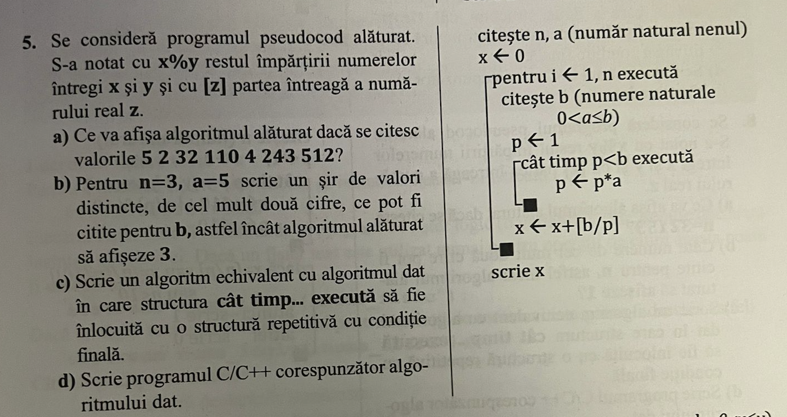

# Algoritmi elementari

## I. Algoritmi care prelucreaza cifrele unui numar

- Spargerea in cifre a numarului n si prelucrarea cifrelor de la dreapta la stanga
```c++
    while (n) {
        // Extrager ultima cifra
        int lastDigit = n % 10;

        // Eliminare ultima cifra din numar
        n = n / 10;
    }
```

- Spargerea in cifre a numarului n si prelucrarea cifrelor de la stanga la dreapta
```c++
    int positions = 1;
    // Aflam numarul de cifre din numarul initial
    while ((positions * 10) <= n) {
        positions = positions * 10;
    }

    // Cat timp contorul ce contine numarul de cire > 0
    while (positions != 0) {
        // Extragem prima cifra
        int firstDigit = n / positions;

        // Taiem din n prima cifra
        n = n % p;

        // Taiem din p o pozitie, deoarece am extras numarul
        positions = positions / 10;
    }
   
```
### IMPORTANT: Spargerea in cifre a unui numar distruge valoarea initiala a acestuia! Este necesara crearea unei copii a lui `n`, inainte de a se efectua extragerea cifrelor, asta in cazul in care mai avem nevoie de valoarea initiala.

## Exemple de algoritmi ce folosesc spargerea pe cifre:

1. Construirea oglinditului si verificare `n` daca este palindrom
    ```c++
        int isPalindrom(int n) {
        // Facem o copie lui N deoarece avem nevoie de valoarea initiala
        int copieN = n;
        // Initializam oglindit la 0
        int oglindit = 0;

        while (copieN > 0) {
            // Extragem ultima cifra din numar
            int ultimaCifra = copieN % 10;

            // Il adaugam la oglindit, de aceea avem nevoie
            // de  inmultirea cu 10, deoarece ne mutam o pozitie mai la stanga (unitati, zeci, sute, etc)
            oglindit = oglindit * 10 + ultimaCifra;

            // Taiem  ultima cifra din copie
            copieN = copieN / 10;
        }

        // Daca oglinditul este egal cu valoarea initiala
        // Inseamna ca avem un palindrom
        return oglindit == n;
    }
    ```

2. Media aritmetica a cifrelor nenule
    ```c++
        float medieNumereNenule(int n) {
            // Declaram suma float ca sa evitam truncherea la int
            float suma = 0.0;
            int contorCifreNenule = 0;
            while (n > 0) {
                int ultimaCifra = n % 10;
                // Daca ultima cifra este mai mare ca 0
                // Actualizam suma si contorul de cifre nenule
                if (ultimaCifra > 0) {
                    suma = suma + ultimaCifra;
                    contorCifreNenule++;
                }
                
                n = n / 10;
            }
            // In cazul in care avem cel putin o cifra nenula
            // Calculam media
            if (contorCifreNenule > 0) {
                return suma / contorCifreNenule;
            }
            // Altfel inseamna ca avem un numar = 0
            else {
                return 0;
            }
        }
    ```
3. Cifra maxima din `n`
    ```c++
        int cifraMaxima(int n) {
            int maxim = 0;
            while (n > 0) {
                int lastDigit = n % 10;
                if (lastDigit > maxim) {
                    maxim = lastDigit;
                }

                n = n / 10;
            }

            return maxim;
        }

    ```
4. Eliminarea cifrelor impare din `n`
    ```c++
    int eliminareCifreImpare(int n) {
        // Varibila pentru a tine numarul nou format prin eliminarea
        // cifrelor impare
        int numarNou = 0;
        // Variabila pentru a contoriza pozitia unitatilor, zecilor, etc.
        int pozitie = 1;
        while (n > 0) {
            int ultimaCifra = n % 10;
            // Daca ultima cifra este para, o extragem si o adaugam la numarul nou
            if (ultimaCifra % 2 == 0) {
                // Numarul nou devine valoarea precedenta +
                // ultimaCifra inmultita cu pozitia
                numarNou = numarNou + ultimaCifra * pozitie;
                pozitie = pozitie * 10;
            }

            // Eliminare ultima cifra
            n = n / 10;
        }

        return numarNou;
    }
    ```
    - NOTA: Daca se doreste eliminarea cifrelor pare, tot ce trebuie sa facem va fi sa modificam conditia din:
        - `ultimaCifra %2 == 0` in ` ultimaCifra %2 != 0`

5. Dublarea aparitiilor cifrelor pare din `n`
    ```c++
        int dublareAparitiiCifrePare(int n) {
            // Variabila pentru a tine numarul nou. Practic recreem numarul, si dublam cifra in cazul in care aceasta este para.
            int numarNou = 0;
            // Variabila pentru a contoriza pozitia unitatilor, zecilor, etc.
            int pozitie = 1;
            while (n > 0) {
                int ultimaCifra = n % 10;
                // Daca ultima cifra este para
                if (ultimaCifra % 2 == 0) {
                    // Noul numar are valoare ultimaCifra * pozite + vechea valoare
                    numarNou = numarNou + ultimaCifra * pozitie;
                    // Pozitia se muta mai la stanga
                    pozitie = pozitie * 10;
                }
                // In cazul in care ultima cifra nu este para
                // Tot adaugam ultima cifra la numarul nou. Insa daca este para, aceasta este adaugata de 2 ori.
                numarNou = numarNou + ultimaCifra * pozitie;

                // Incrementam pozitia
                pozitie = pozitie * 10;

                // Eliminam ultima cifra
                n = n / 10;
            }

            return numarNou;
        }
    ```

6. Numararea cifrelor pare existente in `n`
    ```c++
        int numarareCifrePare(int n) {
            // Initializare contor pentru cifre pare
            int contorCifrePare = 0;
            while (n > 0) {
                // Extragem ultima cifra para
                int ultimaCifra = n % 10;
                if (ultimaCifra % 2 == 0) {
                    contorCifrePare++;
                }
                
                n = n / 10;
            }

            return contorCifrePare;
        }
    ```
7. Cifra de control a unui numar `n` se obtine calculand suma cifrelor lui `n` apoi repetand procesul cu cifrele sumei obtinute anterior pana cand se obtine un numar format dintr-o singura cifra, numita `cifra de control`.
    - De exemplu, pentru n = 8579 se obtin pe rand sumele:
        - 8 + 5 + 7 + 9 = 29
        - 2 + 9 = 11
        - 1 + 1 = 2 (`cifra de control`)
- Algoritmul eficient ca timp de executie se bazeaza pe observatia ca cifra de control a unui numar respecta urmatoarea relatie:
    - cifraControl(n) = 
        - 0, daca `n` = 0
        - 9, daca `n` % 9 = 0 si `n` != 0
        - n % 9, altfel
    ```c++
        int cifraControl(int n) {
            while (n > 9) {
                int sumCifra = 0;
                while (n != 0) {
                    int ultimaCifra = n % 10;
                    sumCifra = sumCifra + ultimaCifra;
                    n = n / 10;
                }
                n = sumCifra;
            }
            return n;
        }
    ```

## II. Divizibilitate. Algoritmi care prelucreaza divizorii proprii/improprii/primi ai unui numar.
- Cand vorbim de divizori, trebuie sa aducem in vedere urmatoarele 3 tipuri de divizori:
    1. Divizori improprii:
        - Prin divizori improprii intelegem setul cuprins din numerele 1 si `n` unde `n` este numarul pentru care dorim sa aflam divizorii
    2. Divizori proprii
        - Restul divizorilor care nu apartin setului cu divizori improprii
    3. Divizori primi
        - Divizorii primi sunt divizorii lui `n`, care la randul lor au ca divizori doar pe 1 si pe ei insisi


### Algoritmi fundamentali pentru divizori 
1. Afisare divizori proprii ai lui `n`
    ```c++
        void afisareDivizori(int n) {
            for (int i = 1; i <= n / 2;i++) {
                // Daca n se divide exact la i
                // Inseamna ca i este divizor al lui `n`
                if (n % i == 0) {
                    cout << i << endl;
                }
            }
        }
    ```


2. Afisare divizori primi `n`
    ```c++
       void afisareDivizorPrimi(int n) {
        int divizor = 2;
        while (n > 1) {
            int contorDivizori = 0;
            while (n % divizor == 0) {
                n = n / divizor;
                contorDivizori += 1;
            }

            if (contorDivizori != 0) {
                cout << divizor << endl;
            }

            divizor = divizor + 1;
        }
    }
    ```

### DE RETINUT:
- `N` are numar impar de divizor daca este patrat perfect (de exemplu 36, etc.)
- `N` are exact 3 divizori daca este patrat perfect de numar prim (de exemplu 9, 25, etc.)
- `N` este perfect daca este egal cu suma divizorilor mai mici decat el insusi.
- `A` si `B` sunt numere `prietene` daca `A` este egal cu suma divizorilor lui `B`, mai mici decat `B`, iar `B` este egal cu suma divizorilor lui `A`, mai mici decat `A`.


## III Primalitate. Testarea primalitatii unui numar `n`
- Un numar este prim, daca acesta are ca divizori doar pe 1 si pe el insusi.
    ```c
        int estePrim (int n) {
            int result = 1;
            // Cum un numar trebuie sa aiba pe 1 si pe el insusi ca divizori
            // daca n < 2 atunci rezultatul va fi fals
            if (n < 2) {
                result = 0;
            }
            else {
                // Iteram de la 2 pana la radical din n
                for (int i = 2; i * i <= n; i++) {
                    // Daca n se imparte exact la i
                    // Ins-eamna ca nu este prim
                    if (n % i == 0) {
                        result = 0;
                        break;
                    }
                }
            }

            return result;
        }
    ```

## IV Cel mai mare divizor comun. Cel mai mare multiplu comun

1. Algoritmul  lui Euclid bazat pe impartiri succesive. Varianta eficienta!
    ```c++
        int cmmdc(int a, int b) {
            while (b != 0) {
                int rest = a % b;
                a = b;
                b = rest;
            }
            return a;
        }
    ```
2. Algoritmul lui Euclid  bazat pe scaderi succesive. Mai putin eficient
    ```c++
        int cmmdc(int a, int b) {
            while (b != a) {
                if (a > b) {
                    a = a - b;
                }
                else {
                    b = b - a;
                }
            }
            return a;
        }

    ```
### Cel mai mic multiplu comun se poate determina folosind formula de calcul:  
- CMMMC(a, b) = a * b / cmmdc (a, b)

- Daca numerele a si b sunt multiple intre ele, `cmmdc(a, b)` = 1.

## V. Siruri Recurente. Sirul lui Fibonacii.
- Sirul lui Fibonacii este sirul cu proprietatea ca oricare numar, este suma ultimelor doua numere. Primele 2 numere din sir sunt `0` si `1`.
    - De exemplu, primele 6 numere sunt:
        - `0, 1, 1, 2, 3, 5`

### 1. Algoritm pentru generarea primilor n termeni din sirul Fibonacci
```c++
    void afisareSirFibonacii(int n) {
        int f1 = 0;
        int f2 = 1;
        cout << f1 << " ";
        for (int i = 1; i < n; i++) {
            cout << f2 << " ";
            int next = f1 + f2;
            f1 = f2;
            f2 = next;
        }
    }
```

### 2. Algoritm pentru generarea primilor n termeni pari din sirul Fibonacci
```c++
    void afisareSirPareFibonacii(int n) {
        int f0 = 1;
        int f1 = 1;
        int f2;
        while (n > 0) {
            f2 = f0 + f1;
            if (f2 % 2 == 0) {
                cout << f2 << " ";
                n = n - 1;
            }
            f0 = f1;
            f1 = f2;
        }
    }
```

## VI. Baze de enumeratie. Conversii intre baza `10` si baza `b`, `2<= b <=9`, pentru un numar `n`
1. Din 10 in `b`:
    - Conversia din baza 10 in baza `b`, este realizata prin impartiri succesive la b, cat timp n > 0.
    - Resturile, in ordine inversa obtinerii lor, formeaza numarul in baza `b`, egal cu numarul `n`, in baza 10.
2. Din `b` in 10:
    - Conversia din baza `b` in baza 10, este realizata prin inmultire cu puterile bazei b.
    - Fiecare cifra a numarul in baza b, de la dreapta la stanga, este inmultita cu `b` la puterea `x`, unde x = [0, len), unde `len` este lungimeaza numarului in baza `b`.
    - Exemplu: convertim numarul `1001011` din baza 2 in baza 10:
        - 1 * 2^0 + 1 * 2^1 + 0 * 2^2 + 1 * 2^3 + 0 * 2^4 + 0 * 2^5 + 1 * 2^6 = 75

## Exercitii


---------------------------------------------------
---------------------------------------------------


---------------------------------------------------
---------------------------------------------------


---------------------------------------------------
---------------------------------------------------


---------------------------------------------------
---------------------------------------------------


---------------------------------------------------
---------------------------------------------------


---------------------------------------------------
---------------------------------------------------

∏
---------------------------------------------------


---------------------------------------------------
---------------------------------------------------


---------------------------------------------------