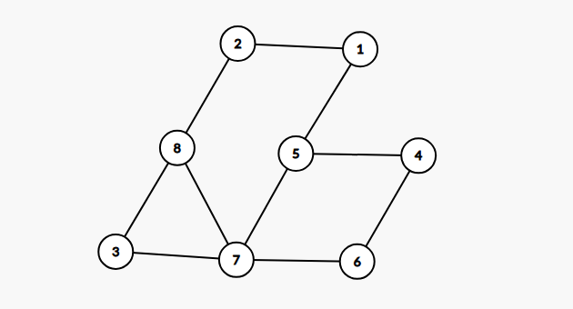

# Rezolvare varianta 8

## Subiectul I
1. b
2. b
3. a [Se genereaza sirurile: 1111, 1110, 1101, 1100, 1011, 1010, 1001, 1000, 0111] 
4. c
    
5. a [Pentru ca nodurile terminale sa fie minime, trebuie ales ca radacina unul din nodurile terminale actuale]
## Subiectul II
1. 
    - a Se va afisa `1`
        ```json
            Algoritmul verifica daca cifra de control a lui n se afla in intervalul [a,b]
        ```
    - b `55`. (Nota: Cifra de control a numarului 99 este 9.)
    - c 
        ```c++
            citeste n, a,b (numere naturale nenule)
            daca a > b atunci
                b <- b+a
                a <- b-a
                b <- b-a
            cat timp n > 9 executa
                s <- 0
                cat timp n > 0 executa
                    s <- s+ n%10
                    n <- [n/10]
                n <- s
            a <- ([a/n]+1) * n
            daca a<= b atunci
                scrie 1
            altfel
                scrie 0
        ```
    - d
        ```c++
            #include <iostream>
            using namespace std;


            int main(){
                int n, a, b;
                cin >> n >> a >> b;
                if (a > b) {
                    b = b+a;
                    a = b-a;
                    b = b-a;
                }
                while (n > 9) {
                    int s = 0;
                    while (n > 0) {
                        s +=  n % 10;
                        n /= 10;
                    }
                    n = s;
                }

                while (a % n != 0) {
                    a++;
                }
                if (a <= b) {
                    cout <<1;
                } else {
                    cout << 0;
                }
                return 0;
            }
        ```
2.  Raspuns corect:
    ```json
         5 5 5 5 5
         2 4 4 4 2
         3 3 3 3 3
         4 2 2 2 4
         1 1 1 1 1
    ```
    - Putem considera matricea ca fiind un patrat impartit in 4 zone:
        1. Zona care este in partea superioarea a patratului, cuprinsa intre cele doua diagonale (Pe care o notam cu A)
        2. Zona care este in partea dreapta a patratului, cuprinsa intre cele doua diagonale (Pe care o notam cu B)
        3. Zona care este in partea inferioara a patratului, cuprinsa intre cele doua diagonale (pe care o notam cu C)
        4. Zona care este in partea stanga a patratului (pe care o notam cu D)
    - Algoritmul interschimba elementele din zona A cu cele din zona C, inclusiv elementele care se afla fix pe cele doua diagonale
3. 
 - a) Se va afisa valoarea `10`
 - b) Pentru c = `10` vom afisa valoarea 10;

## Subiectul III
1. Solutie:
    ```c++
        #include <iostream>
        using namespace std;

        int suma (int n, int a[], int s);

        int main(){
        int n = 8;
        int a[] = {2,20,-10,5,2,3,1,2};
        int s = 10;
        cout << suma(n, a, s);
            return 0;
        }

        int suma (int n, int a[], int s) {
            int lungimeMaxima = -1;
            for (int i = 0; i < n; i++) {
                int lungimeCurenta = 0;
                int suma = 0;
                for (int j = i; j < n;j++) {
                    suma += a[j];
                    lungimeCurenta++;
                    if (suma == s) {
                        if (lungimeCurenta > lungimeMaxima) {
                            lungimeMaxima = lungimeCurenta;
                            break;
                        }
                    } else if (suma > s) {
                        break;
                    }
                }
            }
            return lungimeMaxima;
        }
    ```
2. Solutie:
    ```c++
        #include <iostream>
        #include <cstring>

        using namespace std;

        int main(){
            char text[251];
            cin.getline(text, 251);
            char* cuvant = strtok(text, " ");
            while (cuvant != nullptr) {
                char vocalaAnterioara = 0; // Incepem de la 0, dar putem alege orice valoare mai mica < 'a'
                int esteValid = 1;
                for (int i = 0; i < strlen(cuvant); i++) {
                    if (strchr("aeiou", text[i]))  {
                        if (text[i] < vocalaAnterioara && strchr(cuvant+i+1, text[i]) != nullptr) {
                            esteValid = 0;
                            break;
                        }
                        vocalaAnterioara = text[i];
                    }
                }
                if (esteValid) {
                    cout << cuvant << " ";
                }
                cuvant = strtok(NULL, " ");
            }
            return 0;
        }

    ```
3. 
 - a Solutie: 
    ```c++
        #include <iostream>
        #include <fstream>
        using namespace std;

        int main(){
            ifstream fin("date.in");
            ofstream fout("date.out");
            int frecventa[10]={0};
            int numar;
            while (fin >> numar) {
                int ultimaCifra = numar % 10;
                int primaCifra=ultimaCifra;
                numar /= 10;
                while (numar > 0) {
                    primaCifra = numar % 10;
                    numar /= 10;
                }
                if (primaCifra == ultimaCifra) {
                    frecventa[primaCifra]++;
                }
            }
            for (int i = 1; i < 10; i++) {
                fout<< frecventa[i] << " ";
            }
            fin.close();
            fout.close();
            return 0;
        }
    ```
    - b - Programul este eficient din punct de vedere al memoriei deoarece in orice moment dat noi avem in memorie un vector de frecventa cu cele 9 cifre pentru care vrem sa numaram cate numere incep si se termina cu ele + un singur numar din fisier, si nu toate cele 1 milion de numere posibile. Din punct de vedere al timpului de executie, algoritmul este eficient deoarece efecutam o singura citire a datelor din fisier.