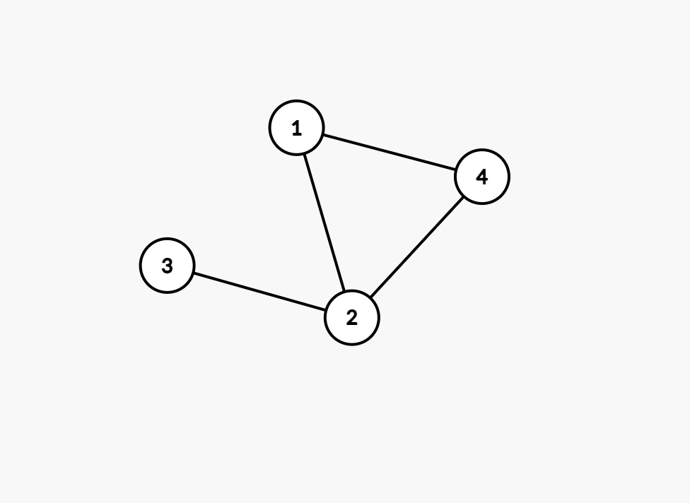
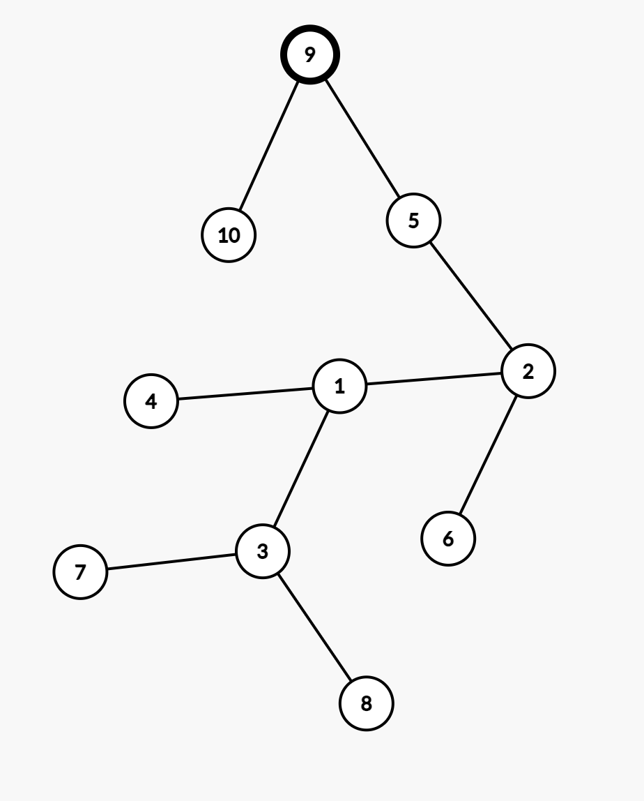

# Test #3 Carte de informatica pentru bacalaureat

## Subiectul I
1. Rezolvare:
    ```json
        x = 4
        y = 0
            x = 3
            y = 0 + 9
            x = 2
            y = 9+4 = 13
            x = 1
            y = 13 +1 = 14
            x = 0
            y = 14
    ```
    - Raspuns corect: `b`
2. Rezolvare:
    ```json
        x = 4
        4 != 0
            4 % 2 = 0
                afisam 2 * 4 => 8
            x = 7
        7 != 0
            7 % 2 != 0
                afisam x => 7
            x = 11
        11 != 0
            11 % 2 != 0
                afisam x => 11
            x = 6
        6 != 0
            6 % 2 == 0
                afisam 2 * x => 2 * 6 => 12
            x = 24
        24 != 0
            24 % 2 == 0
                afisam 2 * x => 2 * 24 = 48
            x = 0
        iesim din while
    ```
    - Raspuns corect: `8 7 11 12 48` adica `a`

3. Rezolvare:
    ```json
        4 la puterea 5
    ```
    - Raspuns corect: `c`

4. Rezolvare:
    ```json
        - Se observa din start ca varianta corecta este b deoarece celalalte sunt gresite din punct de vedere sintactic.
    ```
5. Rezolvare:
    ```json
        Conform enuntului avem graful din poa de mai jos:
    ```
    
    ```json
    Putem observa ca graful nu este nici eulerian, nici hamiltonian deoarece nu poti sa obtii un ciclu in care sa nu se repete unul dintre noduri (conditia pentru graf sa fie hamiltonian) si nodurile nu au toate grad par (cerinte pentru a fi graf eulerian)
    De asemenea observam ca graful nu este complet (adica nu se respecta conditia care cere ca oricare doua varfuri distincte sa fie adiacente, pentru a fi complet). Prin urmare, raspunsul corect este ca graful alaturat este conex
    ```
    - Raspuns corect: `d`
## Subiectul II
1. 
    - a. 
        ```json
            n = 144
            k = 1
            d = 2
            144 != 1
                p = 0
                144 % 2 == 0
                    p =p + 1 = 1
                    n = n/2 = 72
                72 % 2 == 0
                    p = 1 + 1 = 2
                    n = n / 2 = 36
                36 % 2 == 0
                    p = 1 + 2 = 3
                    n = n / 2 = 18
                18 % 2 == 0
                    p = 3 + 1 = 4
                    n = n / 2 = 9
                9 % 2 != 0

                4 % 2 != 1

                d = 3
            9 != 1
                p = 0
                9 % 3 == 0
                    p = 1
                    n = 9 / 3 = 3
                3 % 3 == 0
                    p = 2
                    n = 3 / 3 = 1
                2 % 2  != 1
                d = 4
            1 == 1

            Afisam k => afisam 1
        ```
    - b.
        ```json
            Daca ne uitam la program, pentru 144, mai sus am obtinut 0 deoarece am avut un numar par de impartiri la 2, ca sa obtinem un numar impar, putem sa alegem dublul numarului 144, adica 288.
        ```
    - c. 
        ```c++
            #include <iostream>
            #include <fstream>

            using namespace std;

            int main()
            {
                int n, k = 1, d = 2;
                cin >> n;
                while (n != 1) {
                    int p =0;
                    while ( n % d == 0) {
                        p = p + 1;
                        n = n / d;
                    }

                    if (p % 2 == 1) {
                        k = 0;
                    }
                    d =d + 1;
                }

                cout << k;

                return 0;
            }
        ```
    - d.
        - Inlocuim structura `cat timp` cu `executa.. cat timp.`
        ```json
            citeste n
            k < -1; d <- 2;
            daca n !=1 atunci
            executa
                p <- 0
                cat timp (n % d = 0)
                    p <- p+1; n <-  n/d
                daca (p % 2 = 1) 
                    k <- 0
                d <- d+1;
            cat timp (n != 1)
            scrie k;
        ```

2. 
    - Rezolvare
    ```json
        Daca marcam nodul cu numarul 9 ca fiind radacina, obtinem arborele binar de mai jos:
    ```
    - Raspuns corect: `Nodul 9`
    
3. Rezolvare:
    ```json
        i = 1
            j = 2
                k = 3
                    (k * k == (i * i) + (j*j)) false
                k = 4
                    (k * k == (i * i) + (j*j)) false
                k = 5
                    (k * k == (i * i) + (j*j)) false
                k = 6
                    (k * k == (i * i) + (j*j)) false
                k = 7
                    (k * k == (i * i) + (j*j)) false
            j = 3
                k = 4
                    (k * k == (i * i) + (j*j)) false
                k = 5
                    (k * k == (i * i) + (j*j)) false
                k = 6
                    (k * k == (i * i) + (j*j)) false
                k = 7
                    (k * k == (i * i) + (j*j)) false
            j = 4
                k = 5
                    (k * k == (i * i) + (j*j)) false
                k = 6
                    (k * k == (i * i) + (j*j)) false
                k = 7
                    (k * k == (i * i) + (j*j)) false
            j = 5
                k = 6
                    (k * k == (i * i) + (j*j)) false
                k = 7
                    (k * k == (i * i) + (j*j)) false
            j = 6
                k = 7
                    (k * k == (i * i) + (j*j)) false
        i = 2
            j = 3
                k = 4
                    (k * k == (i * i) + (j*j)) false
                k = 5
                    (k * k == (i * i) + (j*j)) false
                k = 6
                    (k * k == (i * i) + (j*j)) false
                k = 7
                    (k * k == (i * i) + (j*j)) false
            j = 4
                k = 5
                    (k * k == (i * i) + (j*j)) false
                k = 6
                    (k * k == (i * i) + (j*j)) false
                k = 7
                    (k * k == (i * i) + (j*j)) false
            j = 5
                k = 6
                    (k * k == (i * i) + (j*j)) false
                k = 7
                    (k * k == (i * i) + (j*j)) false
            j = 6
                k = 7
                    (k * k == (i * i) + (j*j)) false
        i = 3
            j = 4
                k = 5
                    (k * k == (i * i) + (j*j)) adevarat
                        345
                k = 6
                    (k * k == (i * i) + (j*j)) false
                k = 7
                    (k * k == (i * i) + (j*j)) false
            j = 5
                k = 6
                    (k * k == (i * i) + (j*j)) false
                k = 7
                    (k * k == (i * i) + (j*j)) false
            j = 6
                k = 7
                    (k * k == (i * i) + (j*j)) false
        i = 4
            j = 5
                k = 6
                    (k * k == (i * i) + (j*j)) false
                k = 7
                    (k * k == (i * i) + (j*j)) false
            j = 6
                k = 7
                    (k * k == (i * i) + (j*j)) false
        i = 5
            j = 6
                k = 7
                    (k * k == (i * i) + (j*j)) false
    ```
    - Raspuns corect: 345
        - Aici este vorba si despre o teorema, numerele pitagoreice. Vezi mai multe aici: https://ro.wikipedia.org/wiki/Triplet_pitagoreic 
## Subiectul III

1. Rezolvare:
    ```c++
        #include <iostream>
        #include <cmath>

        using namespace std;
        void perfect(int x[], int n);

        int main()
        {
            int n = 7;
            int x[] = {3, 9, 12, 25, 30, 45, 121};
            perfect(x, n);

            return 0;
        }

        void perfect(int x[], int n) {
            for (int i = 0; i < n; i++) {
                int radical = sqrt(x[i]);
                if (radical * radical == x[i]) {
                    cout << x[i] << " ";
                }
            }
        }
    ```
2. 
    - Pentru rezolvarea acestui exercitiu, doar de dragul de a mai exersa functiile din libraria cstring (string.h) o sa avem mai multe solutii:
    - 1.
        ```c++
            #include <iostream>

            using namespace std;
            int esteVocala(char ch);

            int main() {
                char s[31], rezultat[31];
                cin >> s;
                int pozitieVocala1 = -1;
                int pozitieVocala2 = -1;
                for (int i =0; i < strlen(s); i++) {
                    if (esteVocala(s[i])) {
                        if (pozitieVocala1 == -1) {
                            pozitieVocala1 = i;
                        } else {
                            pozitieVocala2 = i;
                        }
                    }
                }

                strcpy(rezultat, s);
                // Aici suprascriem in rezultat, incepand cu pozitia primei vocale
                strcpy(rezultat + pozitieVocala1, s+pozitieVocala1+1);
                // Aici procedam la fel doar ca ne mutam cu un caracter mai in spate deoarece deja am sters prima vocala
                strcpy(rezultat + pozitieVocala2-1, s+pozitieVocala2);

                cout << rezultat;
                return 0;
            }

            int esteVocala(char ch) {
                if (strchr("aeiou", ch) != NULL) {
                    return 1;
                } else {
                    return 0;
                }
            }

        ```
    2. 
        ```c++
            #include <iostream>

            using namespace std;
            int esteVocala(char ch);

            // In varianta asta, aflam pozitiile celor 2 vocale si evitam sa copiem din s in rezultat atunci cand ne aflam in dreptul lor.
            int main() {
                char s[31], rezultat[31];
                cin >> s;
                int pozitieVocala1 = -1;
                int pozitieVocala2 = -1;
                for (int i =0; i < strlen(s); i++) {
                    if (esteVocala(s[i])) {
                        if (pozitieVocala1 == -1) {
                            pozitieVocala1 = i;
                        } else {
                            pozitieVocala2 = i;
                        }
                    }
                }

                int indexRezultat = 0;
                for (int i = 0; i < strlen(s); i++) {
                    if (i != pozitieVocala1 && i != pozitieVocala2) {
                        rezultat[indexRezultat++] = s[i];
                    }
                }
                rezultat[indexRezultat] = '\0';

                cout << rezultat;
                return 0;
            }

            int esteVocala(char ch) {
                if (strchr("aeiou", ch) != NULL) {
                    return 1;
                } else {
                    return 0;
                }
            }

        ```
    - 3.
        ```c++
            #include <iostream>

            using namespace std;
            int esteVocala(char ch);

            int main() {
                char s[31], rezultat[31];
                cin >> s;
                int pozitieVocala = -1;
                // copiem tot ce avem in s
                strcpy(rezultat, s);
                for (int i =0; i < strlen(s); i++) {
                    if (esteVocala(s[i])) {
                        pozitieVocala = i;
                        break;
                    }
                }
                // suprascriem in rezultat, incepand cu pozitia vocalei
                strcpy(rezultat+pozitieVocala, s+pozitieVocala+1);

                // Cautam ultima vocala, pornind de la capatul sirului
                for (int i =strlen(s)-1; i >= 0; i--) {
                    if (esteVocala(s[i])) {
                        pozitieVocala = i;
                        break;
                    }
                }
                // DIn nou, tinem cont de faptul ca deja am sters o vocala, deci trebuie sa ajustam index-ul de unde stergem
                strcpy(rezultat+pozitieVocala-1, s+pozitieVocala+1);

                cout << rezultat;
                return 0;
            }

            int esteVocala(char ch) {
                if (strchr("aeiou", ch) != NULL) {
                    return 1;
                } else {
                    return 0;
                }
            }

        ```

3. Rezolvare:
    - a.
        ```json
            Din punct de vedere al timpului de executie, programul nostru este eficient deoarece citim o singura data fisierul.
            In timp ce citim din fisier, stocam intr-un vector numerele si totdata, tinem cont de care este numarul curent si numarul anterior citit.
                - Daca numarul curent este mai mare decat numarul citit, atunci incrementam contorul care va tine lungimea secventei curente.
                - Daca numarul curent nu este strict mai mare, atunci am ajuns la sfarsitul unei secvente si inceputul alteia. Acum trebuie sa comparam sa vedem daca lungimea secventei curente este mai mare decat lungimea maxima, daca da, atunci actualizam valoarea contorului care tine lungimea secventei maxime, si mai tinem minte si unde se sfarseste secventa ce are lungimea maxima.
                - Stiind cat este lungimea maxima si unde se sfarseste secventa, putem afla de unde incepe si pana unde tine secventa cu lungime maxima.
                - Scriem in fisier cu parametrul ios::app, parametru care ne permite sa adaugam in fisier, nu sa suprascriem.
        ```
    - b. 
        ```c++
            #include <iostream>
            #include <fstream>


            using namespace std;

            int main() {
                ifstream fin("date.txt");
                ofstream fout("date.txt", ios::app);
                int secventa[10000] = {0};
                int lungimeCurenta, lungimeMaxima, indexSfarsitSecventa = 0;
                int numarCurent, numarAnterior, indexSecventa = 0;
                fin >> numarCurent;
                numarAnterior = numarCurent;
                secventa[indexSecventa] = numarAnterior;
                indexSecventa += 1;
                while (fin >> numarCurent) {
                    secventa[indexSecventa] = numarCurent;
                    if (numarCurent > numarAnterior) {
                        lungimeCurenta++;
                    } else if (lungimeCurenta > lungimeMaxima) {
                        indexSfarsitSecventa = indexSecventa-1;
                        lungimeMaxima = lungimeCurenta;
                        lungimeCurenta = 1;
                    }
                    indexSecventa++;
                    numarAnterior = numarCurent;
                }


                int indexInceputSecventa = indexSfarsitSecventa - lungimeMaxima+1;
                fout << endl;
                for (int i = indexInceputSecventa; i <= indexSfarsitSecventa; i++) {
                    fout <<  secventa[i] << " ";
                }

                fin.close();
                fout.close();
                return 0;
            }
        ```