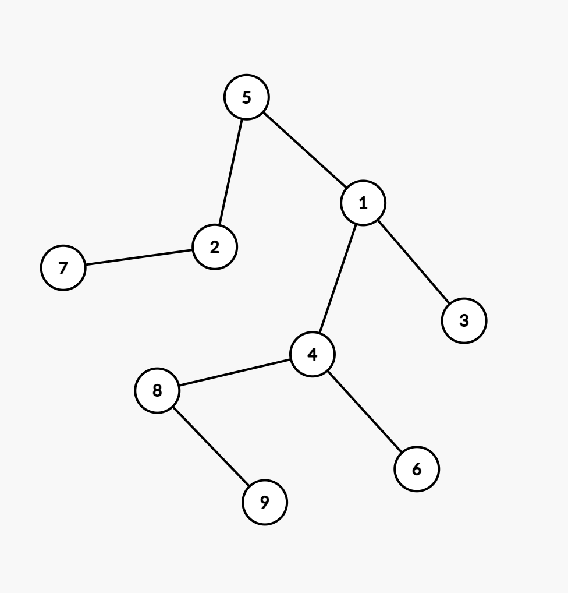
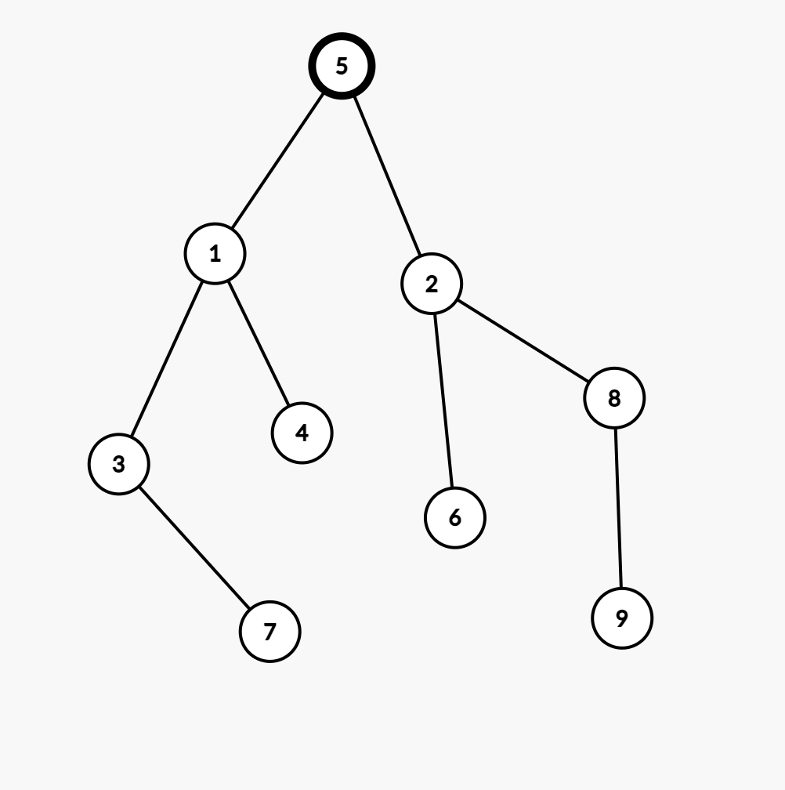

# Rezolvare Subiect #5

## Subiectul I

1. 
    - Rezolvare:
        - Prima expresie ne spune ca prima cifra a lui x este egala cu ultima cifra a lui y
        - A doua expresie ne spune prima cifra a lui y este egala cu ultima a lui x
        - Prima cifra a lui este egala cu ultima sa cifra + 1
        - Acum sa ne gandim la posibile valori:
            (x, y) => (21,12), (43, 34), (54, 45), (65,56), (76, 67), (87, 78),(98, 89)
        - Rezulta ca x-y, in toate cazurile va fi 9. 
        - Raspuns corect: `d`
2. 
    - Rezolvare:
        ```json
            n = 2022, i = 5 => f(404, 6)
                n = 404, i = 6 => f(67, 7)
                    n = 67, i = 7 => f(9, 8)
                        n = 9, i = 8 => f(1, 9)
                            n = 1, i = 9 => f(0, 10)
                                n = 0 => cout 10
        ```
        - Raspuns corect: `b`
3. 
    - Rezolvare:
        - Primele 4 sunt:
            `6 5 4 3 2 1`,
            `6 5 4 3 1 2`,
            `6 5 4 2 3 1`,
            `6 5 4 2 1 3`,
        - Urmatoarele 2 sunt:
            `6 5 4 1 3 2`,
            `6 5 4 1 2 3`
        - Raspuns corect: `c`
4. 
    - Rezolvare:
        - Daca luam prin eliminare variantele:
            - a => pentru 6 varfuri, avem o matrice de adiacenta cu 36 de elemente si conform cerintei am avea 12 valori de 1 si 24 de 0.
            - b => pentru 10 varfuri, avem o matrice de adiacenta cu 100 de elemente, insemnand ca nu putem sa indeplinim conditiile cerintei
            - c => pentru 2 varfuri, avem o  matrice de adiacenta cu 4 elemente, si din nou, nu putem sa indeplinim conditiile cerintei
            - d =>  pentru 9 varfuri, avem o  matrice de adiacenta cu 81 de elemente, si conform cerintei am avea 54 de valori de 0 si 27 de valori de 1
            - Aici putem observa ca `b` si `c` sunt eliminate din start. Mai ramane `a` si `d` ca posibile variante. Insa, stiind ca e vorba de graf neorientat, trebuie ca numarul de valori sa fie par asta deoarece, de exemplu, daca varful (x) mere catre varful (y), fiind neorientat, si varful (y) va mere catre varful (x) rezulta raspuns corect `a`
5.  - Rezolvare:
        - In acest caz trebuie sa luam valorile si pentru fiecare sa generam un arbore:
            * a => x=3 si y = 5 rezulta vectorul de tati: `[5 5 1 1 0 3 5 3 8]`
            ```json
                1 2 3 4 5 6 7 8 9
                5 5 1 1 0 3 5 3 8
                - De aici avem:
                    - nodul 5 radacina
                    - 5 parinte pentru 1, 2 si 7.
                    - Din start cade deoarece nu mai este un arbore binar
            ```
            * b => x = 8 si y = 3 => rezulta vectorul de tati: `[5 5 1 1 0 8 3 8 8]`
            ```json
                1 2 3 4 5 6 7 8 9
                5 5 1 1 0 8 3 8 8
                - De aici avem:
                    - nodul 5 radacina
                    - 5 parinte pentru 1 si 2.
                    - 1 parinte pentru 3 si 4
                    - 8 parinte pentru 7, 8, 9.
                    - Si aceasta varianta cade deoarece nu mai este un arbore binar
            ```
            * c => x = 4 si y = 2 => rezulta vectorul de tati: `[5 5 1 1 0 4 2 4 8]`
            ```json
                1 2 3 4 5 6 7 8 9
                5 5 1 1 0 4 2 4 8
                - De aici avem:
                    - nodul 5 radacina
                    - 5 parinte pentru 1 si 2.
                    - 1 parinte pentru 3 si 4
                    - 4 parinte pentru 6 si 8
                    - 2 parinte pentru 7
                    - 8 parinte pentru 9
                    - Mai jos avem arborele de unde se observa lantul de lungime 4
            ```
            
            * d => x = 2 si y = 3 => rezulta vectorul de tati: `[5 5 1 1 0 2 3 2 8]`
            ```json
                1 2 3 4 5 6 7 8 9
                5 5 1 1 0 2 3 2 8
                - De aici avem:
                    - nodul 5 radacina
                    - 5 parinte pentru 1 si 2.
                    - 1 parinte pentru 3 si 4
                    - 2 parinte pentru 6 si 8
                    - 3 parinte pentru 7
                    - 8 parinte pentru 9.
                    - Mai jos avem arborele specific acestei cerinte de unde se observa ca nu avem un lant de lungime 4
            ```
            
            - Raspuns corect: `c`
## Subiectul II

## Subiectul III
