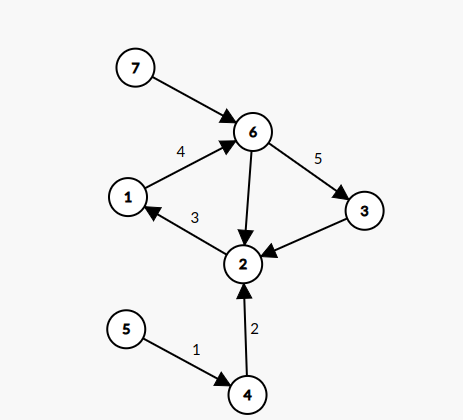
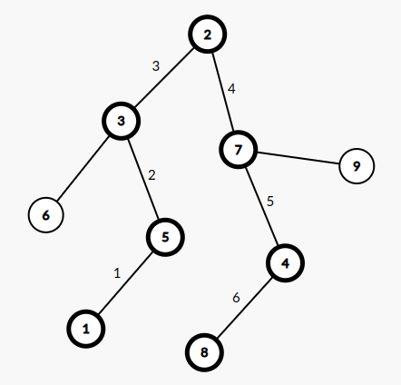

# Rezolvare Subiect #6

## Subiectul I
1. 
    - Rezolvare:
        * a -> `% este operator aritmetic` [`ADEVARAT`]
        * b -> `> este operator relational` [`ADEVARAT`] 
        * c -> `<= este operator logic` [`FALS`] -> Este operator relational. Putem observa si din exemplul de la varianta `b`
        * d -> `&&  este operator logic` [`ADEVARAT`]
        * Raspuns corect: `c`
2. 
    - Rezolvare:
        ```json
            f('B') = f('A') [la intoarcere trebuie sa afisam `B` dar si sa calculam din nou f('A')]
                = Afisam 'A'
            = Afisam 'B' si Afisam 'A'
        ```
    - Raspuns corect `ABA` -> `b`

3. 
    - Rezolvare: 
        * Notam elementele multimii astfel:
            ```json
                0       1       2       3    
                ghiocel zambila narcisa lalea
            ```
        * Primele 6 submultimi generate sunt:

            `ghiocel` -> `[0]`

            `ghiocel zambila` -> `[0 1]`

            `ghiocel zambila narcisa` -> `[0 1 2]`

            `ghiocel zambila narcisa lalea` -> `[0 1 2 3]`

            `ghiocel zambila lalea` -> `[0 1 3]`

            `ghiocel narcisa` -> `[0 2]`
        * Putem observa ca ultima submultime  trebuie sa contina elementul `lalea` deci prin eliminare optiunea `b` este adevarata
            * intr-o alta ordine de idei, se poate observa cum numarul de elemente este crescator in prima faza, dupa care scade deci vom avea ceva de genul 1 element, 2 elemente, 1 element, exact cum avem si in optiunea `b`
4. 
    - Rezolvare:
        * conform cerintei avem urmatorul graf:
            * Tineti cont ca:
                * 1 -> nu este prim
                * 2 -> este prim
                * 3 -> este prim
                * 4 -> nu este prim
                * 5 -> este prim
                * 6 -> nu este prim
                * 7 -> este prim
            * drum elementar: este un drum(lant) in care nu se repeta noduri. Lungimea unui drum este data de numarul de arce.
            * teorie drum elementar: https://www.pbinfo.ro/articole/509/grafuri-orientate#intlink-11
        
        * Se observa ca cel mai lung drum elementar este: [5, 4, 2,1, 6, 3] care are lungimea 5. Raspuns corect: `b`

5. 
    - Rezolvare:
        * Conform vectorului de tati avem:
            ```json
                1 2 3 4 5 6 7 8 9
                5 0 2 7 3 3 2 4 7
            ```
            * Radacina: nodul 2
            * 2 parinte pentru 3 si 7
            * 7 parinte pentru 4 si 9
            * 3 parinte pentru 5 si 6
            * 4 parinte pentru 8
            * 5 parinte pentru 1
        * Arborele corespunzator vectorului de tati este:
        
        * Raspuns corect: 6 -> `d`

## Subiectul II
1. 
    * a
        ```json
            n = 720
            f = 2
            720 > 1
                p = 0
                n % f == 0 true
                    n = 360
                    p = 1
                n % f == 0 true
                    n = 180
                    p = 2
                n % f == 0 true
                    n = 90
                    p = 3
                n % f == 0 true
                    n = 45
                    p = 4
                n % f == 0 fals
                Afiseaza: "2^4*"
                f = 3
            45 > 1
                p = 0
                n % f == 0 true
                    n = 15
                    p = 1
                n % f == 0 true
                    n = 5
                    p = 2
                n % f == 0 fals
                Afiseaza: "3^2*"
                f = 4
            5 > 1
                p = 0
                n % f == 0 fals
                f = 5
            5 > 1
                p = 0
                n % f == 0 true
                    n = 1
                    p = 1
                Afiseaza "5^1*"
        ```
        - Programul afiseaza: `2^4*3^2*5^1*`

    * b -> `1`
    * c
        ```c++
            #include <iostream>

            using namespace std;
            int main() {

                int n;
                cin >> n;
                int f = 2;
                while (n > 1) {
                    int p = 0;
                    while (n % f == 0) {
                        n = n / f;
                        p = p + 1;
                    }
                    if (p != 0) {
                        cout << f <<"^"<<p<<"*";
                    }
                    f= f + 1;
                }
                return 0;
            }
        ```
    * d 
        ```json
            citeste n (numar natural nenul)
            f = 2
            daca n > 1 atunci
            executa
                p <- 0
                daca (n%f) = 0 atunci
                    executa
                        n <- [n/f]
                        p <- p+1
                    cat timp (n % f = 0)
                daca (p!= 0) scrie f, "^",p,"*"
                f <- f+1
            cat timp (n > 1)
        ```
2. 
## Subiectul III