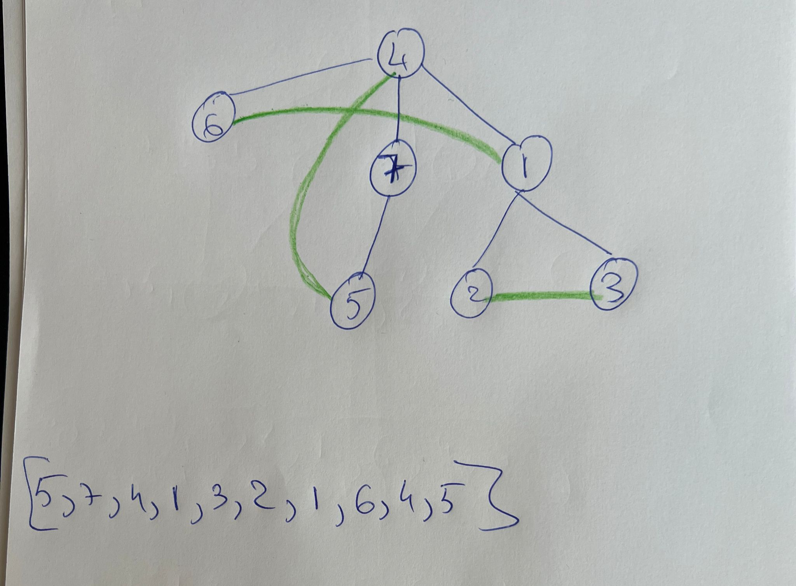

# Rezolvare Simulare bacalaureat informatica 2023

## Subiectul I
1. d
2. b
3. a // In situatii de genul, se incearca eliminarea variantelor care nu au sens, in cazul in care ne este greu sa ne dam seama.
4. d
5. c // 

## Subiectul II
1. 
    - a.  474
    - b.
        - Oricare dintre numerele  521,531,5021, 5031
        - Explicatie:
            ```json
                Algoritmul inlocuieste cifrele de la 5 la 1 cu complementul lor. Prin complement, in cazul
                de fata intelegem numarul care adunat la un alt numar ne da 5. Astfel avem complementele:
                5 -> 0
                4 -> 1
                3 -> 2
                2 -> 3
                1 -> 4
                0 -> 5

                Loop-ul exterior, itereaza de la 5 la 1, si la fiecare iteratie se va inlocui cu complementul sau, cifra egala cu X din numarul de la acel pas (cn in algoritm) . De exemplu:

                Se da 5174
                Iteratia 1, x = 5, n = 5174 -> inlocuim toate aparitiile lui 5 cu complementul sau adica 0 si avem 0174 adica 174
                Iteratia 2, x = 4, n = 174 -> inlocuim toate aparitiile lui 4 cu complementul sau adica 1 si avem 171
                Iteratia 3, x = 3, n = 171 -> inlocuim toate aparitiile lui 3 cu complementul sau adica 2 si avem tot 171 deoarece nu avem deloc cifra 3
                Iteratia 4, x = 2, n = 171 -> inlocuim toate aparitiile lui 2 cu complementul sau adica 3 si avem tot 171 deoarece nu avem deloc cifra 4
                Iteratia 5, x = 1, n = 171 -> Inlocuim toate aparitiile lui 1 cu complementul sau adica 4 si avem numarul 474


                Se da 5021
                Iteratia 1, x = 5, n = 5021 -> inlocuim toate aparitiile lui 5 cu complementul sau adica 0 si avem 0021 adica 21
                Iteratia 2, x = 4, n = 21 -> inlocuim toate aparitiile lui 4 cu complementul sau adica 1 si avem 21 deoarece nu avem deloc cifra 4
                Iteratia 3, x = 3, n = 21 -> inlocuim toate aparitiile lui 3 cu complementul sau adica 2 si avem tot 21 deoarece nu avem deloc cifra 3
                Iteratia 4, x = 2, n = 21 -> inlocuim toate aparitiile lui 2 cu complementul sau adica 3 si avem 31
                Iteratia 5, x = 1, n = 31 -> Inlocuim toate aparitiile lui 1 cu complementul sau adica 4 si avem numarul 34
            ```
    - c.
        ```c++
            #include <iostream>
            using namespace std;


            int main()
            {

                int n, x = 5;
                cin >> n;
                do{
                    int cn = n, p = 1;
                    n = 0;
                    do {
                        int c = cn % 10;
                        if (c == x) {
                            c = 5 - c;
                        }
                        n = c*p+n;
                        cn = cn / 10;
                        p = p * 10;
                    } while (cn != 0);
                    x = x-1;
                } while (x != 0 );
                cout << n;

                return 0;
            }
        ```
        - d.
            ```json
                citeste n
                (numar natural)
                pentru x <- 5,0,-1 executa
                    cn <- n; n<-0;p<-1
                    repeta
                        c<-cn%10
                        daca c=x atunci c <- 5-c
                        n<-c*p+n; cn<-[cn/10]; p<- p*10
                    pana cand cn=0;
                scrie n
            ```
2. Solutie
    - Vectorul de tati este corespunzator grafului de mai jos  .
    - Prin graf eulerian intelegem un graf care contine un ciclu eulerian. Prin ciclu eulerian intelegem un ciclu care contine toate muchiile grafului.
    - Avand in vedere graful din imagine si teoria de mai sus, daca adaugam muchiile [2,3], [1,6], [4,5] obtinem un graf eulerian cu ciclul eulerian [5,7,4,1,3,2,1,6,4,5] rezultand graful din poza de mai jos .

3.  - Explicatie:
        ```json
            - Se observa cum elementele care sunt aflata dupa diagonala secundara, au aceeasi valoare cu cea de pe diagonala secundara iar cele ce se afla inainte de diagonala secundara, au valoarea egala cu ce gasim pe diagonala secundara in acea linie + distanta intre ele
        ```
    - Solutie:
    ```c++
        #include <iostream>
        using namespace std;


        int main()
        {
            int a[5][5] ={0};
            for(int i = 1; i <=5; i++) {
                int pozitieDiagonalaSecundara = 5 - i + 1;
                for(int j = 1; j <=5; j++) {
                if (j == pozitieDiagonalaSecundara) {
                    a[i-1][j-1] = 5 - pozitieDiagonalaSecundara;
                } else if (j < pozitieDiagonalaSecundara) {
                    a[i-1][j-1] = 5 - pozitieDiagonalaSecundara + (pozitieDiagonalaSecundara - j);
                } else {
                    a[i-1][j-1] = 5 - pozitieDiagonalaSecundara;
                }
                }
            }

            for(int i = 1; i <=5; i++) {
                for(int j = 1; j <=5; j++) {
                    cout << a[i-1][j-1] <<" ";
                }
                cout << endl;
            }

            return 0;
        }

    ```

## Subiectul III
1. Solutie:
    ```c++
        #include <iostream>
        using namespace std;

        void NrImp(int x, int y, int &nr);

        int main()
        {
            int nr = 0;
            NrImp(4, 50, nr);
            cout << nr;
            return 0;
        }

        void NrImp(int x, int y, int &nr) {
            int contorNumere = 0;
            for(int i = x; i <= y; i++) {
                int contorDivzori = 0;
                for (int j = 1; j <= i; j++) {
                    if (i % j == 0 && j % 2 != 0) {
                        contorDivzori++;
                    }
                }
                if (contorDivzori == 3) {
                    contorNumere++;
                }
            }
            nr = contorNumere;
        }
    ```

2. Solutie:
    ```c++
        #include <iostream>
        #include <string.h>

        using namespace std;

        int main()
        {
            char text[101], raspuns[101]="";
            cin.getline(text, 101);
            char *cuvant = strtok(text, " ");
            while(cuvant != NULL) {
                if (cuvant[strlen(cuvant)-1] == '.') {
                    if (cuvant[0]=='S') {
                        strcat(raspuns, "spe. ");
                    } else if (cuvant[0] == 'F') {
                        strcat(raspuns, "fam. ");
                    } else {
                        strcat(raspuns, "gen. ");
                    }
                } else {
                    strcat(raspuns, cuvant);
                    strcat(raspuns, " ");
                }
                cuvant = strtok(NULL, " ");
            }
            cout << raspuns;
            return 0;
        }

    ```
3. Solutie:
    - a. In limbaj natural:
        ```json
            Solutia aleasa este eficienta din punct de vedere al timpului de executie deoarece algoritmul parcurge o singura data fisierul ce contine datele de intrare. In acelasi timp, algoritmul este eficient din punct de vedere al memoriei folosite, deoarece in orice moment al executiei, avem in memorie doar 2 numere din fisier si nu se folosesc alte structuri de date, afara de variabila care ne indica valoarea maxima si cea care ne indica numarul total de pasi.
        ```
    - b. C++:
        ```c++
            #include <iostream>
            #include <fstream>

            using namespace std;

            int main()
            {
                ifstream fin("bac.txt");
                int nrCitit, nrAnterior;
                int max = -1;
                int pasiTotali = 0;

                while(fin >> nrCitit) {
                    pasiTotali++;
                    if (nrCitit > max) {
                        max = nrCitit;
                        cout << pasiTotali << " ";
                    } else if (nrCitit == max && nrCitit != nrAnterior) {
                        cout << pasiTotali << " ";
                    }
                    nrAnterior = nrCitit;
                }
                fin.close();
                return 0;
            }
        ``` 