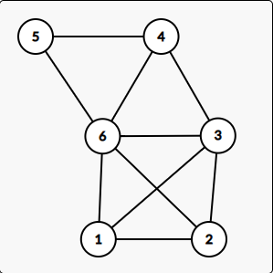
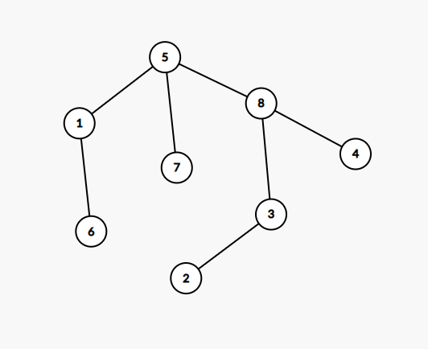

# Varianta 5

## Subiectul I
1. b
2. gresit subiectul dar corect ar fi fost ceva de genul:
    ```c++
        q.p.x = q.p.y = q.z = 0;
    ```
3. Primele 10 numere generate sunt:
    ```c++
    34567
    34568
    34569
    34578
    34579
    34589
    34678
    34679
    34689
    34789
    ```
4. d
    
5. a
    

## Subiectul II
1. 
    - a: 4
        ```json
            Algoritmul numara cate numere sunt formate doar din cifre pare in intervalul  [a,b]
        ```
    - b: 843 
    - c:
        ```c++
            citeste a,b (numere naturale nenule, a <= b)
            nr <- 0
            i <- a
            cat timp i <= b executa
                d <- 1
                aux <- i
                cat timp aux != 0 executa
                    c <- aux % 10
                    daca c% 2 = 1 atunci
                        d <- 0
                    aux <- [aux / 10]
                daca d = 1 atunci
                    nr <- nr + 1;
                
                i <-  i+1
            

            scrie nr;
        ```
    - d
        ```c++
            #include <iostream>

            using namespace std;

            int main()
            {
                int a, b, nr = 0;
                cin >> a >> b;
                for (int i = a; i <= b; i++) {
                    int d = 1;
                    int aux = 1;
                    while (aux != 0) {
                        int c = aux % 10;
                        if (c % 2 == 1) {
                            d = 0;
                        }
                        aux = aux / 10;
                    }
                    if (d == 1) {
                        nr = nr + 1;
                    }
                }

                cout << nr;
                return 0;
            }
        ```
2. Se va afisa: `6`-> lungimea sirului `eneame`
3. Se va afisa valoarea `4`
## Subiectul III